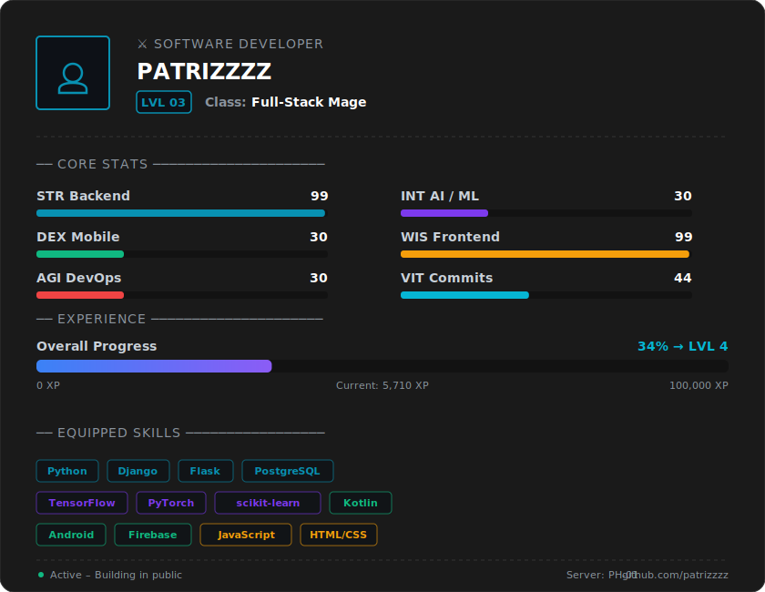

<!--RPG_CARD_START-->
<div align="center">
  
</div>
<!--RPG_CARD_END-->

<div align="center">

```
██████╗  █████╗ ████████╗██████╗ ██╗ ██████╗██╗  ██╗
██╔══██╗██╔══██╗╚══██╔══╝██╔══██╗██║██╔════╝██║ ██╔╝
██████╔╝███████║   ██║   ██████╔╝██║██║     █████╔╝
██╔═══╝ ██╔══██║   ██║   ██╔══██╗██║██║     ██╔═██╗
██║     ██║  ██║   ██║   ██║  ██║██║╚██████╗██║  ██╗
╚═╝     ╚═╝  ╚═╝   ╚═╝   ╚═╝  ╚═╝╚═╝ ╚═════╝╚═╝  ╚═╝
```

</div>

<div align="center">
  <a href="https://git.io/typing-svg">
    
  </a>
</div>

<br/>

<div align="center">
  
  
</div>

---

## `> whoami`

```python
class Patrizzzz:
    role        = ["Software Developer"]
    location    = "🇵🇭 Philippines"
    focus       = ["Machine Learning", "Backend Systems", "Mobile Dev"]
    learning    = ["Deep Learning", "MLOps", "System Design"]
    ask_me      = "Python · Django · Android · AI/ML"
    fun_fact    = "I debug with print statements and I'm not ashamed."
```

---

## `> stack --list`

**AI / ML**


**Backend**


**Frontend & Mobile**


---

## `> git log --stat`

<div align="center">
  
  &nbsp;
  
</div>

<div align="center">
  
</div>

<div align="center">
  
</div>

---

## `> ls ./projects`

<div align="center">

| Project | Description | Stack |
|:--------|:------------|:------|
| [⚡ leyeco3](https://github.com/patrizzzz/leyeco3) | Electric cooperative management system | Python · Django |
| [✅ CLI-TASKMANAGER](https://github.com/patrizzzz/CLI-TASKMANAGER) | Terminal-based task management tool | Python |
| [💰 budget-tracker](https://github.com/patrizzzz/budget-tracker) | Personal finance tracker | Python |
| [🔬 Cellular-automaton](https://github.com/patrizzzz/Cellular-automaton) | Conway's Game of Life & cellular automata | Python |

</div>

---

## `> contact --open`

<div align="center">

[](https://github.com/patrizzzz)

</div>

<div align="center">
  <sub>
    <code>// crafted with ☕ and too many print() statements</code>
  </sub>
</div>